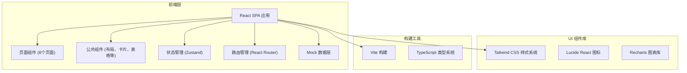
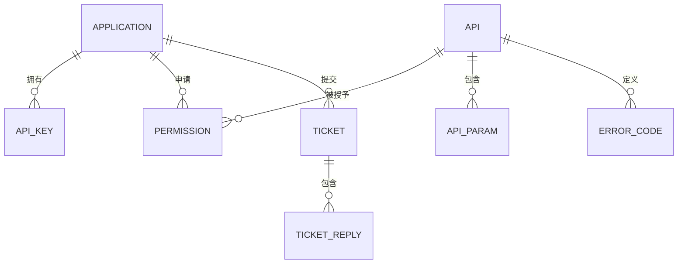

## 1. 架构设计



## 2. 技术描述

- **前端框架**：React 18 + TypeScript
- **构建工具**：Vite 5
- **路由管理**：React Router DOM 6
- **状态管理**：Zustand
- **样式方案**：Tailwind CSS 3
- **图标库**：Lucide React
- **图表库**：Recharts
- **后端**：无（纯前端 Mock 数据）
- **数据**：前端 Mock 数据模拟

## 3. 路由定义

| 路由路径 | 页面名称 | 说明 |
|----------|----------|------|
| / | 开发者门户 | 首页，平台入口 |
| /portal | 开发者门户 | 同首页 |
| /apps | 应用管理 | 我的应用列表 |
| /apps/:id | 应用详情 | 单个应用的详情页 |
| /apis | 接口目录 | 接口列表和分类 |
| /apis/:id | 接口详情 | 接口文档和调试 |
| /debugger | 在线调试 | API 在线调试工具 |
| /keys | 密钥与权限 | 密钥管理和权限配置 |
| /monitor | 调用监控 | 调用统计和监控 |
| /tickets | 工单消息 | 消息中心和工单 |
| /admin | 管理员控制台 | 管理员后台首页 |
| /admin/audit | 入驻审核 | 开发者入驻审核 |
| /admin/apis | 接口管理 | 接口配置管理 |
| /admin/permissions | 权限管理 | 权限申请审批 |
| /admin/monitor | 异常监控 | 异常调用监控 |
| /admin/reports | 报表导出 | 用量报表导出 |

## 4. 数据模型

### 4.1 核心数据类型

```typescript
// 应用
interface Application {
  id: string;
  name: string;
  description: string;
  status: 'active' | 'inactive' | 'pending';
  appKey: string;
  appSecret: string;
  createdAt: string;
  environment: 'sandbox' | 'production';
  category: string;
}

// 接口
interface Api {
  id: string;
  name: string;
  description: string;
  category: string;
  version: string;
  method: 'GET' | 'POST' | 'PUT' | 'DELETE';
  path: string;
  status: 'online' | 'offline' | 'beta';
  requestParams: ApiParam[];
  responseExample: string;
  errorCodes: ErrorCode[];
}

// 接口参数
interface ApiParam {
  name: string;
  type: string;
  required: boolean;
  description: string;
  location: 'query' | 'body' | 'header' | 'path';
}

// 错误码
interface ErrorCode {
  code: string;
  message: string;
  description: string;
}

// 调用统计
interface CallStat {
  date: string;
  count: number;
  successCount: number;
  errorCount: number;
  avgResponseTime: number;
}

// 密钥
interface ApiKey {
  id: string;
  appId: string;
  appKey: string;
  appSecret: string;
  status: 'active' | 'disabled' | 'rotated';
  createdAt: string;
  expiresAt: string;
}

// 权限
interface Permission {
  id: string;
  apiId: string;
  apiName: string;
  appId: string;
  status: 'pending' | 'approved' | 'rejected';
  quota: number;
  usedQuota: number;
  expiresAt: string;
}

// 工单
interface Ticket {
  id: string;
  title: string;
  content: string;
  type: 'question' | 'bug' | 'feature' | 'other';
  status: 'open' | 'processing' | 'resolved' | 'closed';
  createdAt: string;
  replies: TicketReply[];
}

// 消息
interface Message {
  id: string;
  title: string;
  content: string;
  type: 'system' | 'approval' | 'announcement';
  read: boolean;
  createdAt: string;
}

// 公告
interface Announcement {
  id: string;
  title: string;
  content: string;
  type: 'update' | 'maintenance' | 'feature';
  publishDate: string;
}
```

### 4.2 数据关系



## 5. 项目结构

```
src/
├── components/          # 公共组件
│   ├── layout/     # 布局组件
│   │   ├── Sidebar.tsx
│   │   ├── Header.tsx
│   │   └── Layout.tsx
│   ├── common/     # 通用组件
│   │   ├── Card.tsx
│   │   ├── Button.tsx
│   │   ├── Modal.tsx
│   │   ├── Table.tsx
│   │   └── Tabs.tsx
│   └── charts/     # 图表组件
│       └── LineChart.tsx
│       └── BarChart.tsx
├── pages/           # 页面组件
│   ├── Portal/          # 开发者门户
│   ├── Apps/            # 应用管理
│   ├── ApiCatalog/      # 接口目录
│   ├── Debugger/        # 在线调试
│   ├── KeysPermissions/ # 密钥与权限
│   ├── Monitor/         # 调用监控
│   ├── Tickets/         # 工单消息
│   └── AdminConsole/    # 管理员控制台
├── hooks/           # 自定义 hooks
├── store/           # 状态管理
├── mock/           # Mock 数据
├── utils/           # 工具函数
├── types/           # 类型定义
├── App.tsx
├── main.tsx
└── index.css
```

## 6. 状态管理设计

使用 Zustand 管理全局状态：

- **useAppStore**：应用全局状态（当前环境、用户信息等）
- **useApiStore**：接口目录状态（接口列表、筛选条件、详情）
- **useMonitorStore**：监控数据状态（调用统计、日志数据）
- **useMessageStore**：消息和工单状态

## 7. 样式系统

基于 Tailwind CSS 自定义主题配置：

- 自定义颜色调色板（深海蓝主题）
- 自定义字体配置
- 自定义动画和过渡效果
- 响应式断点配置
